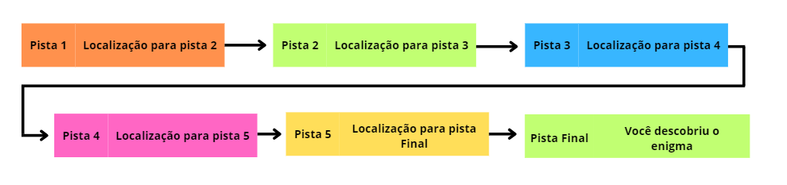
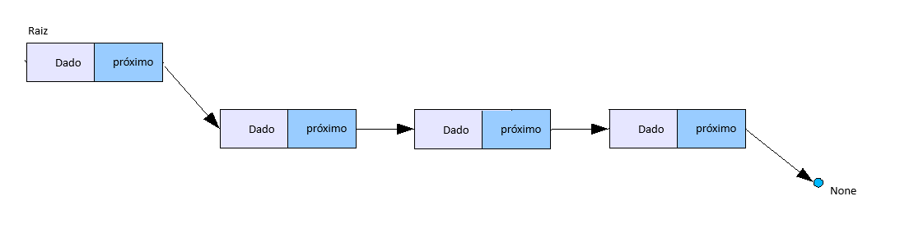

### Pre Requisitos:
- POO (Programação orientada a Objetos)
- Python


# Lista encadeada
Uma lista encadeada é uma estrutura de dados linear e dinâmica (elástica) que guarda "n" dados quaisquer (o dado pode ser um valor primitivo ou um objeto), também guarda a posição para o próximo elemento da lista, ou seja, em uma posição de memória é guardado o dado atual e também guardado o endereço de memória que o próximo dado está guardado (é guardado o dado e um ponteiro para o próximo dado) e sempre o último dado da lista não aponta para nada, ou seja o ponteiro dele é "nulo".

#### Deixando mais claro
Imagine que você precisa resolver um enigma, onde as pistas estão escondidas em lugares diferentes, mas você só vai receber a localização da primeira pista. Chegando lá, você encontra 1 pista e a localização (o caminho) para a próxima pista.

* Exemplo


#### Nó
Para entender listas, primeiro é necessário definir o conceito de "nó", o "nó" é um objeto que tem um dado e tem um link (ou um ponteiro) para o próximo objeto do tipo "nó", podemos definir esse "nó" como uma classe que tem o dado que queremos e também tem outro atributo do tipo "nó".
* Exemplo
    O "nó" seria uma classe pista, onde tem uma pistam associada e tem um ponteiro para a proxima pista.


## E no python, como fica?
- Exemplo em python do "nó"

    ```python

    def __init__(self, dado : object) -> None:
        """
            Construtor da classe Nó
            Args:
                objeto (object): Objeto a ser colocado no nó
        """
        self.dado: object = dado
        self.proximo: No = None

    ```

- ###### Exemplo Visual comumente usado para representar lista encadeada
    


#### Um nó aponta para outro?

Como já foi deixado claro anteriormente, um nó aponta ou tem um link para outro nó, mas como isso funciona? Abaixo tem um pequeno exemplo usando nosso enigma

```python
    ## Descubra o ano
    pista_1 = No("É um ano maior que 1990") # Primeiro elemento da lista, posição 0
    pista_2 = No("É um ano menor que 2000")
    pista_3 = No("O ultimo digito é um divisor de 25")
    pista_4 = No("Esse digito é maior que 2")

    # apontando para o outro, logo teremos a lista
    pista_1.proximo = pista_2
    pista_2.proximo = pista_3
    pista_3.proximo = pista_4
    
    #Acessando a pista 3 através da pista 1
    pista_1.proximo.proximo.dado

```
A forma acima foi usada para exemplificar, no geral você não tem todos os dados antes de fazer a lista, e os dados devem ser alocados de forma dinâmica, não é viável inserir dados de forma manual mesmo se os dados forem conhecidos.

### Agora é lógica
Com esses passos até agora, já é possível ter um entendimento de como a lista encadeada funciona, e com um pouco de esforço é possível deduzir os próximos passos, dentro da pasta "Lista" o código da implementação completa está disponível.

### Métodos Implementados
- `adicionar(dado : object)`: Adiciona o dado no final da lista.
- `adicionar_inicio(dado : object)`: Adiciona o dado no início da lista.
- `adicionar_por_indice(indice : int, dado : object)`: O dado anterior no índice é empurrado o próximo índice
- `deletar_ultimo()`:
- `deletar_primeiro()`:
- `deletar_por_indice(indice : int)`:  O dado posterior é puxado para esse novo índice.
- `busca(dado : object)`: Retorna o índice onde o dado está, -1 se não encontrar nenhum dado
- `busca_por_indice(indice : int)`: Busca o elemento de um determinado índice.
- `obter_tamanho()`: Retorna o tamanho da lista
- `verificar_se_vazia()`: Retorna se a lista está ou não vazia
- `atualizar_elemento_por_indice(indice : int, novo_dado : object)`:
- `imprimir()`:


# Testes

* ##### Cobertura de Código: 
  * 100% de cobertura no código da lista encadeada

* ##### Resumo dos Resultados: 
  * 42 testes executados
  * 42 Teste bem sucedidos
  * 0 Testes com falha

* ##### Notas Adicionais: 
    Os testes foram importantes para descobrir problemas vigentes, pensar em possíveis problemas que poderiam ocorrer e já implementar as soluções para ambos os casos.
    
    Funções que recebem parâmetros tendem a gerar mais problemas, e é necessário ter um olhar mais crítico para tais. 
    
* ##### exemplos de possíveis problemas: 
  * Tentar deletar elementos da lista vazia
  * Passar index que não existe.
  * Passar um tipo errado de dado em parâmetros

Muitos mais exemplos podem ser dados, de como os testes ajudaram a criar um melhor código.


* ##### Código-fonte dos Testes: 
  * Testes na pasta `testes_unitarios`


### Executar os testes
- ##### Pré-Requisitos
  - `pytest` instalado
- ##### Como executar
  - Clonar/baixar essa pasta (Essa é pasta raiz da Lista encadeada)
    - para rodar todos os testes unitários:
        Na raiz do projeto executar no bash/cmd o comando
        ```bash
          pytest teste_unitarios
        ```
        
    - Para gerar um relatório de cobertura de código em HTML:
      Na raiz do projeto executar no bash/cmd o comando
      ```bash
        pytest
      ```


## Implementações
* Lista encadeada: Na pasta `lista`
* Testes na pasta `testes_unitarios`
