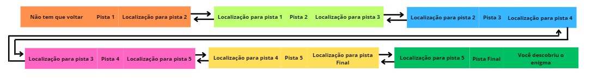

### Pre Requisitos:
- Entender a Lista encadeada Simples
- POO (Programação orientada a Objetos)
- Python


### Lista Duplamente Encadeada
A lista duplamente encadeada é parecida com a lista encadeada simples, com a sua principal diferença sendo que cada nó da lista tem duas ligações, uma para o próximo elemento (como na lista encadeada simples) e outra para o elemento anterior, assim cada elemento sabe quem é o antecessor e o sucessor.


#### Deixando mais claro
Imagine que você precisa resolver um enigma, onde as pistas estão escondidas em lugares diferentes, mas você só vai receber a localização da primeira pista, chegando lá, você encontra 1 pista e a localização (o caminho) para a proxima pista.
Agora imagine que você foi para a pista 2 sem ler a dica da pista 1, não vai ser possivel retornar para a pista 1, já que a pista 2 tem a dica dela e o caminho para a pista 3, mas não tem o caminho para a pista 1. Acontece que precisamos que cada pista agora tenha a informação do caminho para a pista anterior e para a proxima pista.



### E no python, como fica?
Supondo que o conceito de "Nó" está claro, abaixo segue exemplos da classe Nó em python para a lista duplamente encadeada. Lembrando que agora o "Nó" tem referência para o próximo elemento da lista e para o elemento anterior.

- Exemplo em python do "nó" 

    ```python

    def __init__(self, dado : object) -> None:
        """
            Construtor da classe Nó
            Args:
                dado (object): Objeto a ser colocado no nó
        """
        self.dado: object = dado
        self.anterior: No = None
        self.proximo: No = None

    ```

#### Um nó aponta para outros?
```python
    ## Descubra o ano
    pista_1 = No("É um ano maior que 1990") # Primeiro elemento da lista, posição 0
    pista_2 = No("É um ano menor que 2000")
    pista_3 = No("O ultimo digito é um divisor de 25")
    pista_4 = No("Esse digito é maior que 2")

    # apontando para o outro, logo teremos a lista
    pista_1.proximo = pista_2
    
    pista_2.anterior = pista_1
    pista_2.proximo = pista_3

    pista_3.anterior = pista_2
    pista_3.proximo = pista_4

    pista_4.anterior = pista_3
    
    #Acessando a pista 3 através da pista 1
    pista_1.proximo.proximo.dado

```

### Agora ficou fácil
Você já implementou a lista encadeada, essa aqui funciona de forma análoga, boa sorte, dentro da pasta "lista" o código da implementação completa está disponível.


### Métodos Implementados
- `adicionar(dado : object)`: Adiciona o dado no final da lista.
- `adicionar_inicio(dado : object)`: Adiciona o dado no início da lista.
- `adicionar_por_indice(indice : int, dado : object)`: O dado anterior no índice é empurrado o próximo índice
- `deletar_ultimo()`:
- `deletar_primeiro()`:
- `deletar_por_indice(indice : int)`:  O dado posterior é puxado para esse novo índice.
- `busca(dado : object)`: Retorna o índice onde o dado está, -1 se não encontrar nenhum dado
- `busca_por_indice(indice : int)`: Busca o elemento de um determinado índice.
- `obter_tamanho()`: Retorna o tamanho da lista
- `verificar_se_vazia()`: Retorna se a lista está ou não vazia
- `atualizar_elemento_por_indice(indice : int, novo_dado : object)`:
- `imprimir()`:


# Testes

* ##### Cobertura de Código: 
  * 100% de cobertura no código da lista encadeada

* ##### Resumo dos Resultados: 
  * 42 testes executados
  * 42 Teste bem sucedidos
  * 0 Testes com falha

* ##### Notas Adicionais: 
    Os testes foram importantes para descobrir problemas vigentes, pensar em possíveis problemas que poderiam ocorrer e já implementar as soluções para ambos os casos.
    
    Funções que recebem parâmetros tendem a gerar mais problemas, e é necessário ter um olhar mais crítico para tais. 
    
* ##### exemplos de possíveis problemas: 
  * Tentar deletar elementos da lista vazia
  * Passar index que não existe.
  * Passar um tipo errado de dado em parâmetros

Muitos mais exemplos podem ser dados, de como os testes ajudaram a criar um melhor código.


* ##### Código-fonte dos Testes: 
  * Testes na pasta `testes_unitarios`


### Executar os testes
- ##### Pré-Requisitos
  - `pytest` instalado
- ##### Como executar
  - Clonar/baixar essa pasta (Essa é pasta raiz da Lista encadeada)
    - para rodar todos os testes unitários:
        Na raiz do projeto executar no bash/cmd o comando
        ```bash
          pytest teste_unitarios
        ```
        
    - Para gerar um relatório de cobertura de código em HTML:
      Na raiz do projeto executar no bash/cmd o comando
      ```bash
        pytest
      ```


## Implementações
* Lista encadeada: Na pasta `lista`
* Testes na pasta `testes_unitarios`