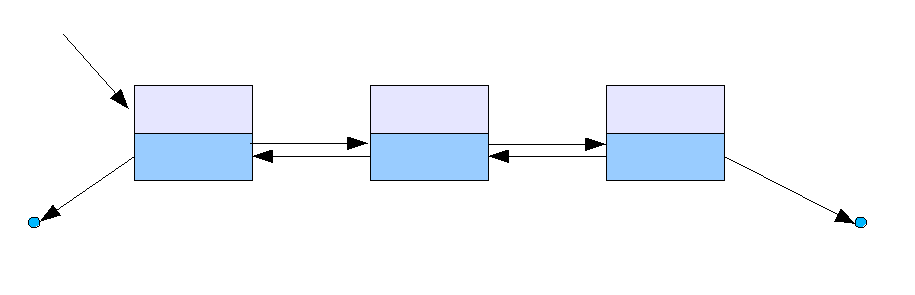
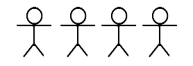

### Pre Requisitos:
- Entender a Lista encadeada Simples
- POO (Programação orientada a Objetos)
- Python


### Lista Duplamente Encadeada
A lista duplamente encadeada é parecida com a lista encadeada simples, com a sua principal diferença sendo que cada nó da lista tem duas ligações, uma para o próximo elemento (como na lista encadeada simples) e outra para o elemento anterior, assim cada elemento sabe quem é o antecessor e o sucessor.


Imagine uma fila de pessoas onde cada pessoa sabe que está atrás dela e também quem está na frente, abaixo está um desenho ilustrativo, onde por exemplo podemos ver que a pessoa 2 aponta para a pessoa 1 e para a pessoa 3. (Leve em conta que cada boneco está numerado, começando do 1 e terminando no 4)


Supondo que o conceito de "Nó" está claro, abaixo segue exemplos da classe Nó em python para a lista duplamente encadeada. Lembrando que agora o "Nó" tem referência para o proximo elemento da lista e para o elemento anterior.

- Exemplo em python do "nó" 

    ```python

    def __init__(self, objeto : object) -> None:
        """
            Construtor da classe Nó
            Args:
                objeto (object): Objeto a ser colocado no nó
        """
        self.objeto: object = objeto
        self.anterior: No = None
        self.proximo: No = None

    ```

- Exemplo em python do "nó" para Pessoa

    ```python

    def __init__(self, pessoaFila : Pessoa) -> None:
        """
            Construtor da classe Nó
            Args:
                objeto (Pessoa): Objeto Pessoa a ser colocado no Nó
        """
        self.pessoa: Pessoa = pessoaParam
        self.anterior: No = None
        self.proximo: No = None

    ```
    Uma pessoa na fila que sabe a localização da próxima pessoa da fila e também da pessoa anterior.

#### Implementações
* Lista duplamente encadeada: Na pasta `app`
* Testes na pasta `testUnitarios`


### Rodar os testes
- Clonar/baixar essa pasta (Essa é pasta raiz da Lista encadeada)
- para rodar todos os testes unitários:
    Na raiz do projeto executar no bash/cmd o comando
    ```bash
      pytest testUnitarios
    ```
    
- Para gerar um relatório de cobertura de código em HTML:
    Na raiz do projeto executar no bash/cmd o comando
    ```bash
      pytest
    ```